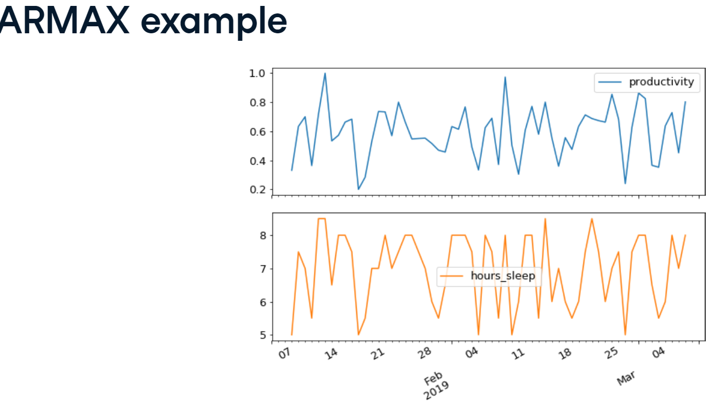

# Arima models in python

### Importing data
```python
import pandas as pd

df = pd.read_csv('data.csv', parse_dates=['date'], index_col='date')
```

Important notions :
- Trend : Positive (increasing values) or negative (decreasing values)
- Seasonality : Regular pattern of up and down fluctuations
- Cyclical : Regular pattern of up and down fluctuations, but the length of the cycle is not fixed
- white noise : values are uncorellated they don't depend on previous data

Stationarity  : 
The distribution of data doesn't change with time,
it must follow 3 criterias : 
- Trend stationnarity : Trend is zero 
- Variance is constant 
- autocorrelation is constant

Train - test split :
````python
df_train = df.loc[:'2019']
df_test = df.loc['2020':]
````

## Testing whether the time series is stationary
```python
from statsmodels.tsa.stattools import adfuller

results = adfuller(df_train['Close'])
````
the 0th value of results is the test statistic, the more negative it is the more likely the time series is stationary.
the 1st element is the p-value : low p-value => reject null hypothesis => reject non-stationary => stationary
the critical values are in the fifth element (4th index)
## Making a time series stationary :
we can take the difference : 
delta y(t) = y(t) - y(t-1)
```python
df_stationary = df.diff() #Nan at first because there's no previous value
df_stationary = df.diff().dropna() #to remove the Nan
```

other transformrs :
````python
amazon_log = np.log(amazon/amazon.shift(1)))
amazon_log = amazon_log.dropna()
df_stationary= np.sqrt(df)
df_stationary=df.shift(1)/df
````

### AR models:
Autoreressive model : (linear regression on previous values):
y_t = a_1 * y_(t-1) + epsilon #first order AR model AR(1)
y_t = a_1 * y_(t-1) + a_2 * y_(t-2) + epsilon #second order AR model AR(2)
y_t = a_1 * y_(t-1) + a_2 * y_(t-2) + ... + a_p * y_(t-p) + epsilon #p order AR model AR(p)


### MA models:
Moving average model 
MA(1)
y_t = m_1 * epsilon_(t-1) + epsilon_t
MA(q) : y_t = m_1 * epsilon_(t-1) +.. +  epsilon_t

###ARMA models :
AR + MA : Autoregressive moving average
ARMA(1,1)  :
y_t = a1 * y_(t-1) + m1 * epsilon_(t-1) + epsilon_t

in gneral : ARMA(p,q) p is order of AR part and q is order of MA part

### Creating ARMA data :
y_t = O.5 y_(t-1)+ 0.2 epsilon_(t-1) + epsilon_t
```python
from statsmodels.tsa.arima_process import arma_generate_simple
ar_coefs = [1, -0.5] #we pass the negative coeficient for the ar part
ma_coefs = [1, 0.2]
y = arma_generate_simple(ar_coefs, ma_coefs, nsample=100, sigma=0.1) #100 data points and 0.1 std

```
The list ar_coefs has the form [1, -a_1, -a_2, ..., -a_p].
The list ma_coefs has the form [1, m_1, m_2, ..., m_q],
### Fitting time series models:
````python
from statsmodels.tsa.arima.model import ARIMA
model = ARIMA(df, order=(p,d,q)) #p is the order of the AR model, d is the differencing, q is the order of the MA model #d=0 => ARMA
results = model.fit()
results.summary()

````

### ARMAX : 
ARMA model with exogenous variables (ARMA + linear regression)
ARMAX(1,1) : y_t = x1*z_t + a1 * y_(t-1) + m1 * epsilon_(t-1) + epsilon_t

```python
from statsmodels.tsa.arima.model import ARIMA
model = ARIMA(df["main_column"], order=(p,0,q), exog=df["exo_column"])
results = model.fit()

```

### Forcasting :
````python
result= model.fit()
forecast = result.get_prediction(steps=-25) #last 25 days , dynamic predictions : dynamic =True
mean_forcast = forecast.predicted_mean
confidence_level = forecast.conf_int() #dataframe low and upper limits
plt.figure()
plt.plot(dates,mean_forcast,color='red',label='forecast')
plt.fill_between(dates,confidence_level['lower main_column'],confidence_level['upper main_column'],color='pink')

````

FOrcasting : 
````python
forecast = results.get_forecast(steps=25) #number of steps

````