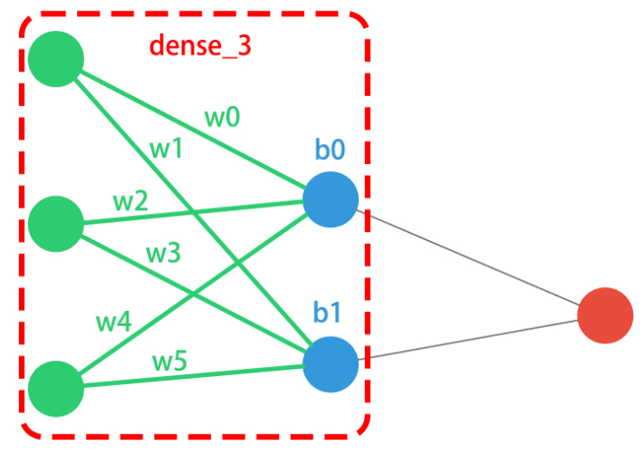
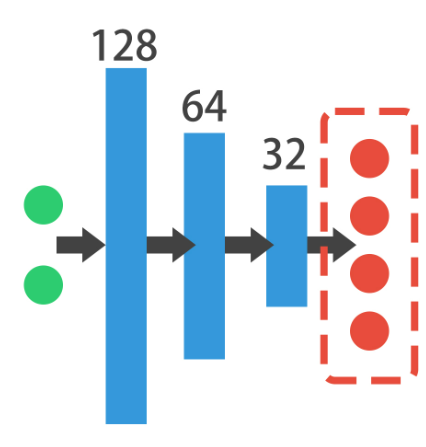
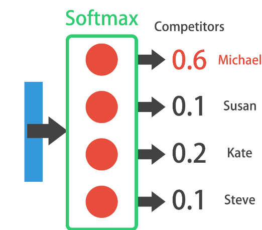

# Introduction to deep learning with keras 
Keras is a high-level neural networks API, written in Python and capable of running on top of TensorFlow, CNTK, or Theano. It was developed with a focus on enabling fast experimentation. Being able to go from idea to result with the least possible delay is key to doing good research.
Neural netwrosk are best used to both extract relevant features from unstructured data like pictures and sound.

When to use it :
* Dealing with unstructured data
* don't need easily interpretable results
* you can benefit from a known architecture

We can build neural networks with Keras using the sequential API or the functional API. The sequential API 
## Creatin a NN with the sequential API
Sequential model is a linear stack of layers. We can create a Sequential model by passing a list of layer instances to the constructor. 
Builing model as a stack of layes : 

```python
from tensorflow.keras.models import Sequential
from tensorflow.keras.layers import Dense # fully connected layer

model = Sequential()
model.add(Dense(2, input_shape=(3,),activation="relu")) # 2 neurons, 3 input features
model.add(Dense(1)) # 1 neuron output
#summarize the model :
model.summary() #table describe the architecture
```


### Compiling a model :
Before training a model, you need to configure the learning process, which is done via the compile method. It receives three arguments:
* An optimizer. This could be the string identifier of an existing optimizer (such as rmsprop or adagrad), or an instance of the Optimizer class.
* A loss function. This is the objective that the model will try to minimize. It can be the string identifier of an existing loss function (such as categorical_crossentropy or mse), or it can be an objective function.
* A list of metrics. For any classification problem you will want to set this to metrics=['accuracy']. A metric could be the string identifier of an existing metric or a custom metric function.
```python
model.compile(optimizer="adam", loss="mse")
```
now it's ready to get trained 
### Training model :
````python
model.fit(X_train, y_train, epochs=10, batch_size=32) #using back propagation
````
to get predictions :
````python
predictions = model.predict(X_test)
````

To quickly evaluate the model :
````python
model.evaluate(X_test, y_test)
````

## Binary classification with Keras
2 classes : 0 or 1

To check if the data is well seperable
```python
import seaborn as sns
sns.pairplot(circles, hue="target")
```
NN : 
We need the sigmoi function for the output layer because it returns a probability between 0 and 1
```python
from tensorflow.keras.models import Sequential
from tensorflow.keras.layers import Dense

model = Sequential()

model.add(Dense(4, input_shape=(2,), activation="tanh")) # 4 neurons, 2 input features

model.add(Dense(1, activation="sigmoid")) # 1 neuron output

model.compile(optimze="sgd", loss="binary_crossentropy") # metrics=["accuracy"] , binar_crossentrope is used usually with sigmoid functions
model.train(coordinates, target, epochs=20)
preds = models.predict(coordinates)
```

## Multi-class classification with Keras



````python
from tensorflow.keras.models import Sequential
from tensorflow.keras.layers import Dense
model.add(Dense(128, input_shape=(2,), activation="relu")) # 4 neurons, 2 input features
model.add(Dense(64, activation="relu")) # 4 neurons, 2 input features
model.add(Dense(32, activation="relu")) # 4 neurons, 2 input features


model.add(Dense(4, activation="softmax")) # 1 neuron output
model.compile(optimiozed="adam", loss="categorical_crossentropy", metrics=["accuracy"]) # metrics=["accuracy"] , binar_crossentrope is used usually with sigmoid functions
````