# Introduction to deep learning with keras 
Keras is a high-level neural networks API, written in Python and capable of running on top of TensorFlow, CNTK, or Theano. It was developed with a focus on enabling fast experimentation. Being able to go from idea to result with the least possible delay is key to doing good research.
Neural netwrosk are best used to both extract relevant features from unstructured data like pictures and sound.

When to use it :
* Dealing with unstructured data
* don't need easily interpretable results
* you can benefit from a known architecture

We can build neural networks with Keras using the sequential API or the functional API. The sequential API 
## Creatin a NN with the sequential API
Sequential model is a linear stack of layers. We can create a Sequential model by passing a list of layer instances to the constructor. 
Builing model as a stack of layes : 

```python
from tensorflow.keras.models import Sequential
from tensorflow.keras.layers import Dense # fully connected layer

model = Sequential()
model.add(Dense(2, input_shape=(3,),activation="relu")) # 2 neurons, 3 input features
model.add(Dense(1)) # 1 neuron output
#summarize the model :
model.summary() #table describe the architecture
```


### Compiling a model :
Before training a model, you need to configure the learning process, which is done via the compile method. It receives three arguments:
* An optimizer. This could be the string identifier of an existing optimizer (such as rmsprop or adagrad), or an instance of the Optimizer class.
* A loss function. This is the objective that the model will try to minimize. It can be the string identifier of an existing loss function (such as categorical_crossentropy or mse), or it can be an objective function.
* A list of metrics. For any classification problem you will want to set this to metrics=['accuracy']. A metric could be the string identifier of an existing metric or a custom metric function.
```python
model.compile(optimizer="adam", loss="mse")
```
now it's ready to get trained 
### Training model :
````python
model.fit(X_train, y_train, epochs=10, batch_size=32) #using back propagation
````
to get predictions :
````python
predictions = model.predict(X_test)
````

To quickly evaluate the model :
````python
model.evaluate(X_test, y_test)
````

## Binary classification with Keras
2 classes : 0 or 1

To check if the data is well seperable
```python
import seaborn as sns
sns.pairplot(circles, hue="target")
```
NN : 
We need the sigmoi function for the output layer because it returns a probability between 0 and 1
```python
from tensorflow.keras.models import Sequential
from tensorflow.keras.layers import Dense

model = Sequential()

model.add(Dense(4, input_shape=(2,), activation="tanh")) # 4 neurons, 2 input features

model.add(Dense(1, activation="sigmoid")) # 1 neuron output

model.compile(optimze="sgd", loss="binary_crossentropy") # metrics=["accuracy"] , binar_crossentrope is used usually with sigmoid functions
model.fit(coordinates, target, epochs=20)
preds = models.predict(coordinates)
```

## Multi-class classification with Keras


````python
from tensorflow.keras.models import Sequential
from tensorflow.keras.layers import Dense
model.add(Dense(128, input_shape=(2,), activation="relu")) # 4 neurons, 2 input features
model.add(Dense(64, activation="relu")) # 4 neurons, 2 input features
model.add(Dense(32, activation="relu")) # 4 neurons, 2 input features


model.add(Dense(4, activation="softmax")) # 1 neuron output
model.compile(optimizer="adam", loss="categorical_crossentropy", metrics=["accuracy"])
````
We need to prepare out dataset :

```python
import pandas as pd
from tensorflow.keras.utils import to_categorical

df.column = pd.Categorical(df.column)
df.column = df.column.cat.codes
y= to_categorical(df.column) #hot encoded 1 to the label 0 otherwise
```
````python
category_labels = df.Name.cat.categories
category_codes = df.Name.cat.codes.unique()

# Creating a dictionary mapping labels to category codes
label_to_code = dict(zip(category_labels, range(len(category_labels))))

````
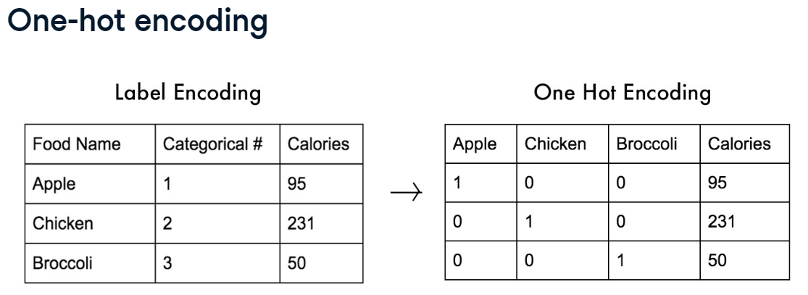


## Multi-Label classification:
we ca assign multiple labels to a single instance
```python
from tensorflow.keras.models import Sequential
from tensorflow.keras.layers import Dense
model = Sequential()
model.add(2, input_shape=(2,), activation="relu")
model.add(3, activation="sigmoid") # 3 outputs each represents the probability of the label
model.compile(optimizer="adam", loss="binary_crossentropy", metrics=["accuracy"])
model.fit(X_train, y_train, epochs=200, validation_split=0.2) #to print the accuracy, a percentage of the training data is left to measure the accuracy

```
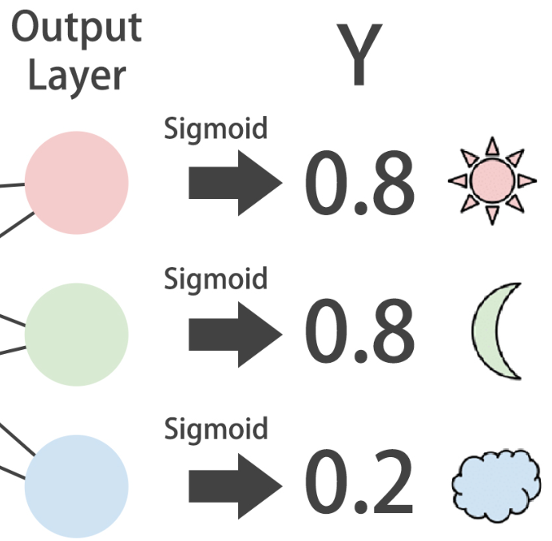

````python
#example : 
# Train for 100 epochs using a validation split of 0.2
model.fit(sensors_train, parcels_train, epochs = 100, validation_split = 0.2)

# Predict on sensors_test and round up the predictions
preds = model.predict(sensors_test)
preds_rounded = np.round(preds)

# Print rounded preds
print('Rounded Predictions: \n', preds_rounded)

# Evaluate your model's accuracy on the test data
accuracy = model.evaluate(preds_rounded, parcels_test)[1]

# Print accuracy
print('Accuracy:', accuracy)
````

## Keras Call back:
A call back is a function that is executed after another function or task is finished.
A kera call back is a call back that is executed after each epoch or after the training has finished.

````python
history = model.fit(X_train, y_train, epochs=100,validation_data=(X_test,Y_test),metrics=["accuracy"], validation_split=0.2)
#We can add the validation_data=(X_test,Y_test) to store the validation loss and accuracy : 

print(history.history["loss"])# loss function values
print(history.history["accuracy"]) # accuracy
print(history.history["val_loss"]) # validation loss
print(history.history["val_accuracy"]) # validation accuracy
# r
````
To avoid overfitting we can make usage of the earlystopping call back
````python
from tensorflow.keras.callbacks import EarlyStopping
early_stopping_monitor = EarlyStopping(monitor="val_loss",patience=3) # if the validation loss doesn't decrease for 3 epochs, the training will stop
model.fit(... , callbacks=[early_stopping_monitor])
````

We can also save our model while training using the ModelCheckpoint call back
````python
from tensorflow.keras.callbacks import ModelCheckpoint
model_checkpoint = ModelCheckpoint("best_model.h5", monitor="val_loss", save_best_only=True) # save the best model
model.fit(... , callbacks=[model_checkpoint])
````

### Learning Curves :
overfitting signs :
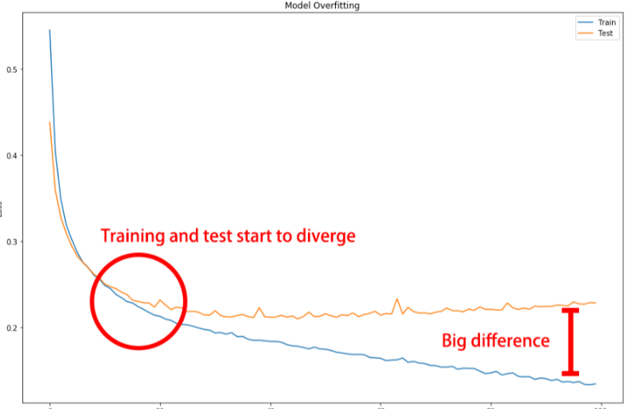
overfitting happens when as epochs go by the test loss gets worse (higher) because of the model starting to lose generalization power.
but not all curves are smooth : 
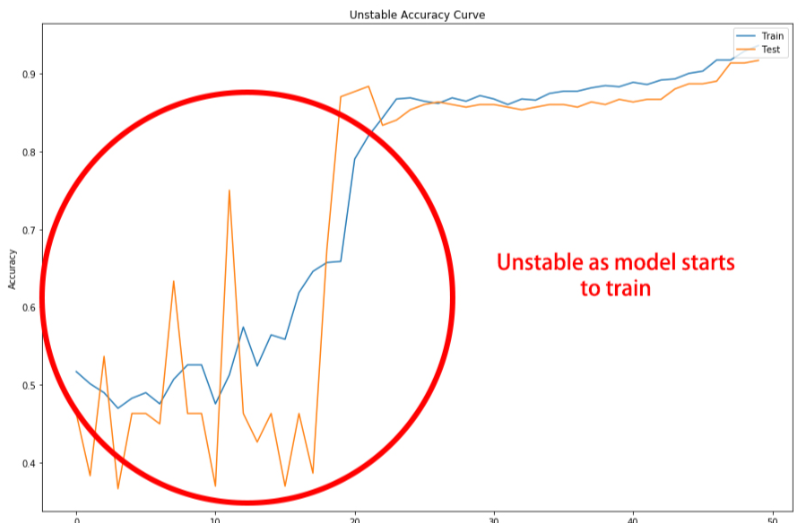
````python
initial_weights= model.get_weights()
train_acc=[]
test_acc=[]
for train_size in train_sizes : 
    X_train_fac, _ ,y_train_fac,_ = train_test_split(X_train, y_train, train_size=train_size)
    model.set_weights(initial_weights)
    model.fit(X_train_fac, y_train_fac, epochs=100, callbacks=[EarlyStopping(monitor="loss",patience=1)], verbose=0)
    train_acc.append(model.evaluate(X_train_fac, y_train_fac, verbose=0)[1])
    test_acc.append(model.evaluate(X_test, y_test, verbose=0)[1])
    plt.plot(train_sizes, train_acc, "o-", label="Train accuracy")

````
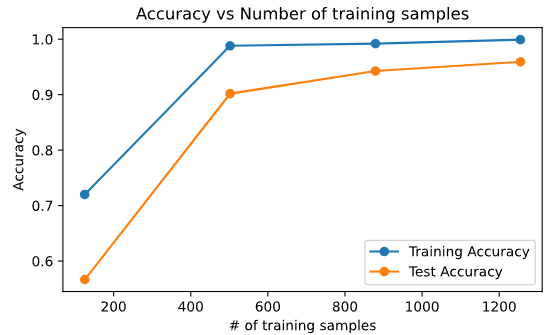


## Activation functions 
testing different activation functions  :

````python
np.random.seed(1) #so that weight initialisation is the same across all models 
def get_model(act_function):
    model = Sequential()
    model.add(Dense(32, input_shape=(1,), activation=act_function))
    model.add(Dense(16, activation=act_function))
    model.add(Dense(1, activation="sigmoid"))
    return model

activations = ["relu","sigmoid","tanh", "leaky_relu"]
results={}
for f in activations:
    model = get_model(f)
    model.compile(optimizer="adam", loss="category_crossentropy", metrics=["accuracy"])
    history=model.fit(X_train, y_train, epochs=100,validation_data=[X_test,y_test] verbose=0)
    results[f] = history

v_loss_per_f = {k:v.history["val_loss"] for k,v in results.items()}
val_loss_curves = pd.DataFrame(v_loss_per_f)
val_loss_curves.plot(title="Testing various activation functions")
````
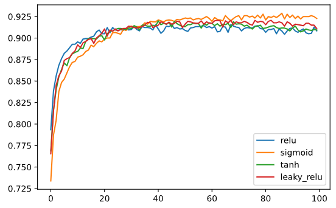

## Batch size and Batch normalization
Mini-batches : using a subset fo training data to update the weights multiple times per epoch :
Advantages : 
* faster computation
* less memory
* better generalization (can escape local minimas because of the noise)
Desadvantages :
* Needs more iterations 
* needs tweaking tof ind the optimal batch size
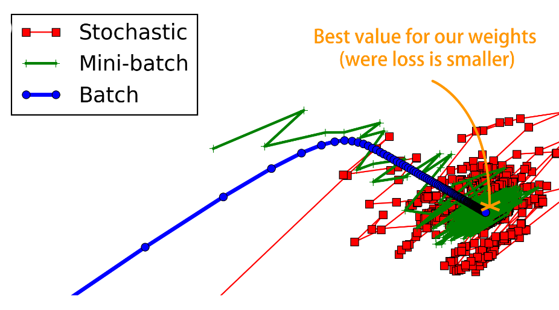 (stochasitc : batch size of 1)
* It's better to use powers of 2 as batch sizes 
````python
model.fit(... , batch_size = 128) #by default it's set to 32
````

### Normalization :
Standaraization :(a normalization approach)
(data -mean)/(standard deviation)

We usually normalize our input data for better results especially if the features have different scales
but the hidden layers in the network doesn't get normalized, so we can use batch normalization to normalize the hidden layers
Batch normalization :
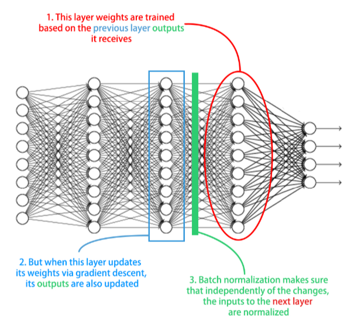
Benefits : 
* faster training (higher training rate)
* improves gradient flow
* reduces dependence on weight initialization

````python
from tensorflow.keras.layers import BatchNormalization
# we add this batchnormalization layer inbetween our layers
model = Sequential()
model.add(Dense(32, input_shape=(10,), activation="relu"))
model.add(BatchNormalization())
model.add(Dense(1, activation="sigmoid"))
````

## Hyperparameter tuning:
We can tune ,  the number of layers , of neurons per layer, optimizers etc..
We can use grid search or random search to find the best hyperparameters
````python
from tensorflow.keras.wrappers.scikit_learn import KerasClassifier
from sklearn.model_selection import RandomizedSearchCV
from tensorflow.keras.models import Sequential
from tensorflow.keras.layers import Dense

def create_model(optimizer="adam", activation="relu"):
    model = Sequential()
    model.add(Dense(32, input_shape=(10,), activation=activation))
    model.add(Dense(1, activation="sigmoid"))
    model.compile(optimizer=optimizer, loss="binary_crossentropy", metrics=["accuracy"])
    return model

model = KerassClassifier(build_fn=create_model,epochs = 20,batch_size=32, verbose=0)
#we can perform cross validation
from sklearn.model_selection import cross_val_score
kfold = cross_val_score(model, X,y,cv=5)
kfold.mean()
kfold.std()

#Random search : not many epocs, smaller sample
params = dict(optimizer=["adam", "sgd"], activation=["relu", "tanh"],batch_size=[5,12,30])
random_search = RandomizedSearchCV(model, param_distributions=params, cv=3)
random_search_results= random_search.fit(X,y)
print("Best : %f using %s".format(random_search_results.best_score_, random_search_results.best_params_))
````
to tune other parameters we tweak the create_model function
````python
from tensorflow.keras.optimizers import Adam
def create_model(nl=1,nn=256,learning_rate=0.01, activation="relu"):
    model = Sequential()
    opt = Adam(lr=learning_rate)
    model.add(Dense(16,input_shape=(10,), activation=activation))
    for i in range(nl):
        model.add(Dense(nn, activation="relu"))
    model.compile(optimizer=opt, loss="binary_crossentropy", metrics=["accuracy"])
    return model
params = dict(nl=[1,2,3], nn=[32,64,128,256], learning_rate=[1,2,0.05], activation=["relu", "tanh"])
random_search = RandomizedSearchCV(model, param_distributions=params, cv=3)
random_search_results= random_search.fit(X,y)
print("Best : %f using %s".format(random_search_results.best_score_, random_search_results.best_params_))


````

## Knowing more about layers: 
````python
first_layer= model.layers[0]
print(first_layer.input) #input shape 
print(first_layer.output) #output shape
print(first_layer.weights) #weights and biases
````
Calculations in neural networks are made using Tensors :
* 0D tensor : scalar
* 1D tensor : vector
* 2D tensor : matrix
* 3D tensor : 3D array (Array of Matrices)
````python
import tensorflow.keras.backend as K
inp = model.layers[0].input
out = model.layers[0].output
#Function that maps layer inputs to outputs
inp_to_out = K.function([inp], [out])
#passing the input to the function
inp_to_out([X_train])
````
## Autoencoders :
It's a special type of neural network that is trained to copy its input to its output
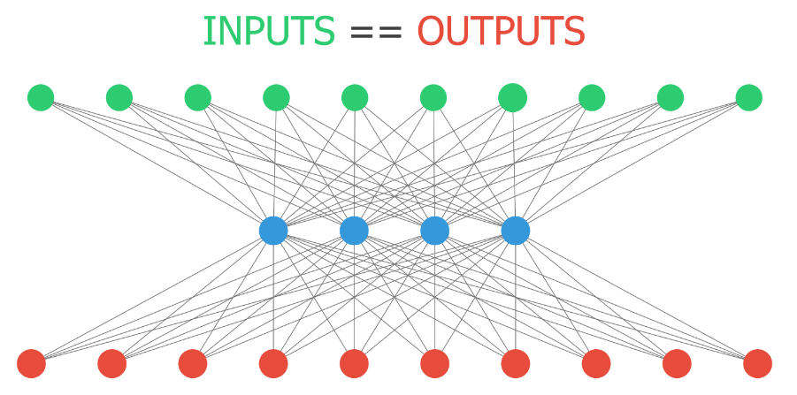
````python
#100 input , 100 output
autoencoder = Sequential()
autoencoder.add(Dense(32, input_shape=(100,), activation="relu"))
autoencoder.add(Dense(100, activation="sigmoid"))
autoencoder.compile(optimizer="adam", loss="binary_crossentropy")
encoer = Sequential()
encoder.add(autoencoder.layers[0])
encoder.predict(X_test) # to get the encoded data, compressed data, 32 values representing the 100 inputs
````

## Intro to CNNs
Convolution is a special mathematical operation that preserves the spatial relationship between pixels by learning image features using small squares of input data.
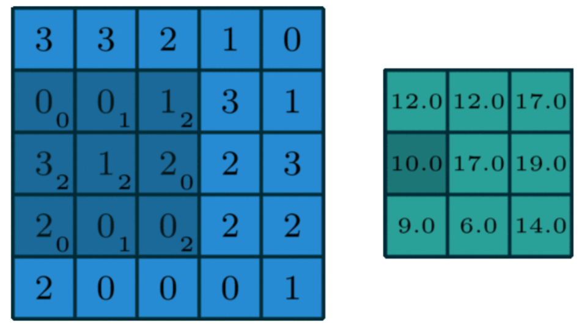
3 by 3 kernel
images have 3 dimensions : width, height and depth (RGB)
````python
from tensorflow.keras.layers import Conv2D, Dense, Flatten

model = Sequential()

model.add(Conv2D(32, kernel_size=3, activation="relu", input_shape=(28,28,1))) # 64 filters (learn 64 diferent conv masks) input shape: 28x28 pixels black and white
model.add(Conv2D(8, kernel_size=3, activation="relu")) # 32 filters #flatten
modeL.add(Flatten())
model.add(Dense(3, activation="softmax")) # 3 classes

````
````python
# Obtain a reference to the outputs of the first layer
first_layer_output = model.layers[0].output

# Build a model using the model's input and the first layer output
first_layer_model = Model(inputs = model.layers[0].input, outputs = first_layer_output)

# Use this model to predict on X_test
activations = first_layer_model.predict(X_test)

# Plot the activations of first digit of X_test for the 15th filter
axs[0].matshow(activations[0,:,:,14], cmap = 'viridis')

# Do the same but for the 18th filter now
axs[1].matshow(activations[0,:,:,18], cmap = 'viridis')
plt.show()
````
ResNet50 is a pretrained model for image classification
````python
from tensorflow.keras.preprocessing import image
from tensorflow.keras.applications.resnet50 import preprocess_input, ResNet50, decode_predictions

img = image.load_img("image.jpg", target_size=(224,224))
img_array = image.img_to_array(img) #numpy array
img_array = np.expand_dims(img_array, axis=0) #add a dimension to transform the array into a batch of size 1 from (224,224,3) => (1,224,224,3)
img_array = preprocess_input(img_array) #preprocess the image in the same way training data were
model = ResNet50(weights="imagenet")
pred = model.predict(img_array)
print("Predicted : ", decode_predictions(pred, top=3)[0])

layer_outputs = [layer.output for layer in model.layers]  # Get the output of each layer
activation_models = [Model(inputs=model.input, outputs=output) for output in layer_outputs]  # Models to get the activations

# Predict and get the activations for each layer
activations = [m.predict(img_array,verbose=0) for m in activation_models]#intermediate outputs
plt.figure(figsize=(20, 20))
layer_count = len(activations)
for i, activation in enumerate(activations[:-1]):
    num_filters = activation.shape[-1]
    for j in range(min(num_filters, 10)):
        plt.subplot(10, layer_count, j * layer_count + i + 1)
        try:
            plt.imshow(activation[0, :, :, j], cmap='viridis')
        except:
            pass
        plt.axis('off')

# Save the figure before showing it
plt.savefig("plot_output.png")
plt.show()

# Decode the predictions of the last layer's activations
preds = model.predict(img_array)
print("Predicted:", decode_predictions(preds, top=3)[0])
````


## LSTMs
Long short term memory networks are a type of recurrent neural network that are capable of learning order dependence in sequence prediction problems.
it's a type of reccurent neural network that uses past predictions.
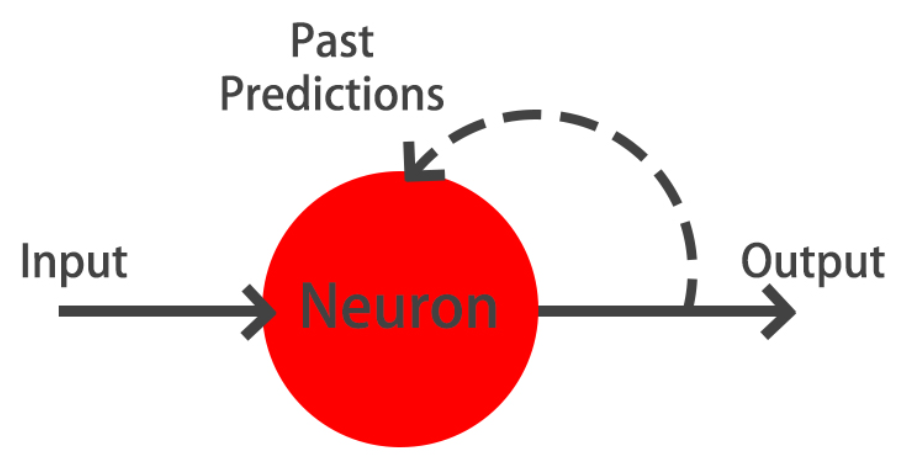
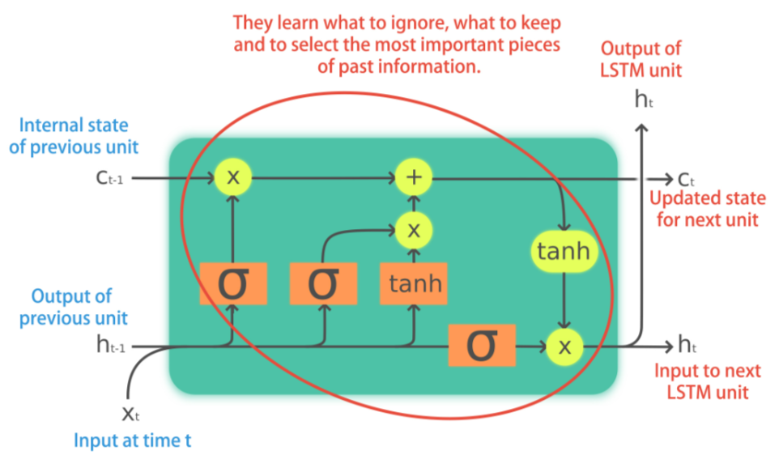
### Using lstms on text :
NNN deal with numbers so we need to transform each unique word into a number .
These number can be used as inputs to an ebedding layer, which learns to represent words as vectors of a predetermined size.
The vectors encode meaning and context of words.
````python
text= "Tpoac is a big Potato ha"

seq_length = 3
words =  text.split()
lines = []
for i in range(seq_length, len(words)+1):
    seq = words[i-seq_length:i]
    line = " ".join(seq)
    lines.append(line)
````
Teknizing the text  :
````python
from tensorflow.keras.preprocessing.text import Tokenizer
tokenizer = Tokenizer()
tokenizer.fit_on_texts(lines)
sequences = tokenizer.texts_to_sequences(lines)
index_to_word = tokenizer.index_word #dictionary , index to word to decode the output later on
````
````python
from tensorflow.keras.layers import Embedding, LSTM, Dense

model = Sequential()

vocab_size = len(tokenizer.word_index) + 1 #0 is reserved for special characters, the dictionary starts at 1 not 0;
model.add(Embedding(input_dim=vocab_size, input_length=2,output_dim=8)) #we input 2 words,output 8 dimensional vector
model.add(LSTM(8)) #return_sequences=True because we want to predict the next word
model.add(Dense(8, activation="relu"))
model.add(Dense(vocab_size, activation="softmax")) #output layer (predict next word)
model.compile(optimizer="adam", loss="categorical_crossentropy", metrics=["accuracy"])

````