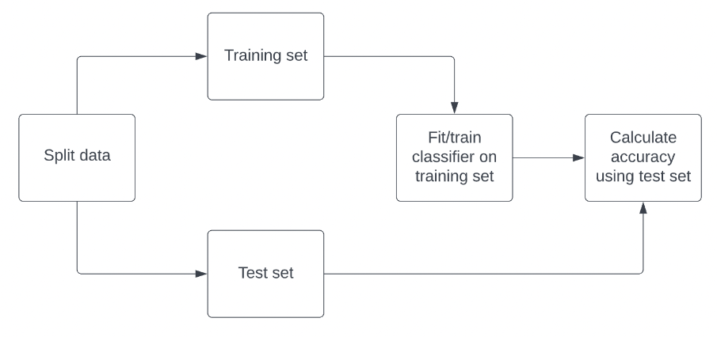
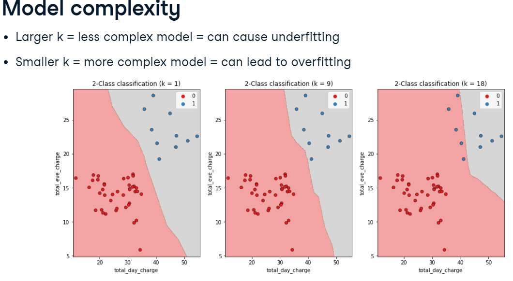
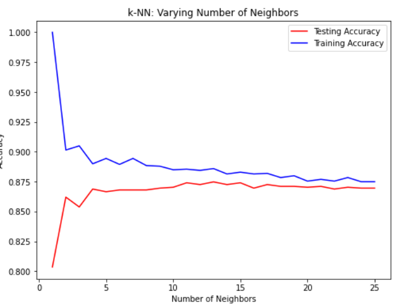
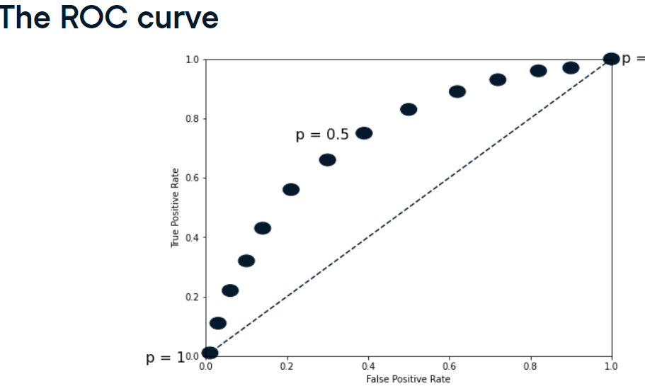
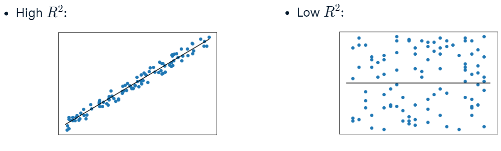
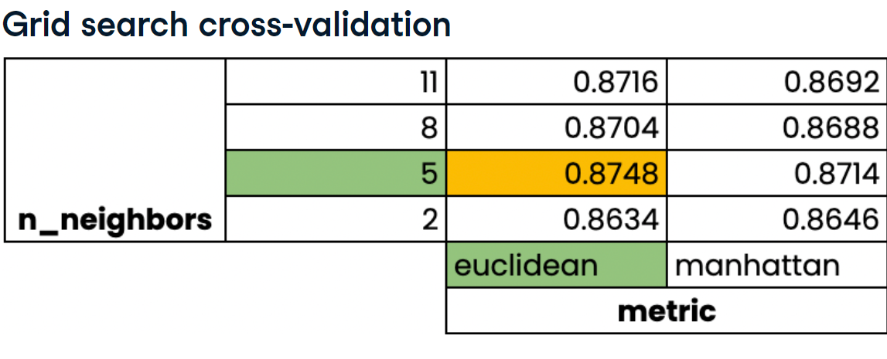
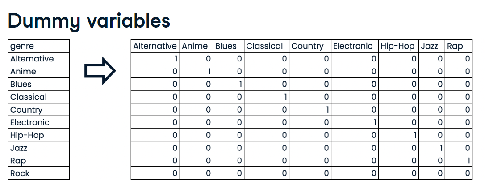

# Supervised learning with scikit-learn :

### Before using supervised learning :
#### Requirements:
- No missing values
- Data in numeric format
- Data stored in pandas DataFrame or NumPy array
- Perform Exploratory Data Analysis (EDA) first
#### General scikit-learn syntax :
```python
from sklearn.module import Model
model = Model()
model.fit(X, y)
predictions = model.predict(X_new)
```
#### Computing accuracy :

```python
from sklearn.model_selection import train_test_split
X_train, X_test, y_train, y_test = train_test_split(X, y, test_size=0.3, random_state=21, stratify=y)
# stratify=y : it's good practice to stratify the labels so that they are distributed in train and test sets as they are in the original dataset
# it's good practice to stratify the labels so that they are distributed in train and test sets as they are in the original dataset
```
# Classification :
## k-Nearest Neighbbors :
predict the labet of any data point by looking at the "k" closest labeled data points the data point takes the majority label of those points.
always each column is a feauture, and each row is a new observation
```python
from sklearn.neighbors import KNeighborsClassifier
X = df[['feature1', 'feature2']].values #array each collumn is a feature and each row a new observation
# in most cases we use X= df.drop('target', axis=1).values
y = df['target'].values #1d array (column) and has the same number of rows as X
# .values : DF => np array
# X.shape = (n, 2) and y.shape = (n,)
knn = KNeighborsClassifier(n_neighbors=6)
knn.fit(X, y)
X_new = np.array([[5.6, 2.8], [3.4, 1.9], [1.2, 0.2]]) 
print(X_new.shape) # (3, 2) => 2 features 3 observations
new_prediction = knn.predict(X_new)

```
### Measuring model performance :
- Accuracy : fraction of correct predictions :

````python
from sklearn.model_selection import train_test_split X_train, X_test, y_train, y_test train_test_split(X, y, test_size=0.3, random_state=21, stratify=y)
#stratify to make y split equal
# like in #computing accuracy section
print(knn.score(X_test, y_test)) # get the accuracy

````
### interpretation : 

```python
# Create neighbors
neighbors = np.arange(1, 12)
train_accuracies = {}
test_accuracies = {}

for neighbor in neighbors:
  
	# Set up a KNN Classifier
	knn = KNeighborsClassifier(n_neighbors=neighbor)
  
	# Fit the model
	knn.fit(X_train,y_train)
  
	# Compute accuracy
	train_accuracies[neighbor] = knn.score(X_train, y_train)
	test_accuracies[neighbor] = knn.score(X_test, y_test)
print(neighbors, '\n', train_accuracies, '\n', test_accuracies)
```

13 neighbors is += best 

### Model performace and accuracy : 
Class imbalance : uneven frequency of classes :
- Accuracy is not a good measure of model performance
We use Confusion matrix :
- True Positives (TP) : correctly labeled positive values
- True Negatives (TN) : correctly labeled negative values
- False Positives (FP) : incorrectly labeled positive values
- False Negatives (FN) : incorrectly labeled negative values
The class of interest is called the Positive class .
Accuracy = **(tp +tn)/(tp+tn+fp+fn)**
Precision: positive predictive values   = **tp/(tp+fp)** : the fraction of positive predictions that are correct : 
Recall : sensitivity = (tp)/(tp+fn) : the fraction of the truly positive instances that the classifier recognizes : high recall means low false negatives
F1 score : 2 * (precision * recall)/(precision + recall) 
`sklearn.metrics.confusion_matrix(_y_true_, _y_pred_, _*_, _labels=None_, _sample_weight=None_, _normalize=None_)`
```python
from sklearn.metrics import classification_report, confusion_matrix
print(confusion_matrix(y_test, y_pred))
print(classification_report(y_test, y_pred))
```
### Logistic Regression :
calculates the probability of a data point belonging to a binary class :
use of sigmoid function :
Lease squares method : 
$$W = argmin_{W}(||\sigma(XW) - Y||²)$$
Maximum Likelihood estimation  :
$$W = argmax_{W}(\prod_{i=1}^n P(y_i | x_i))$$
```python)
if p>0.5 => class 1
else: class 0
it produces a linear decision boundary 
```python
from sklearn.linear_model import LogisticRegression
logreg = LogisticRegression()
logreg.fit(X_train, y_train)
y_pred = logreg.predict(X_test)
# for the probability :
y_pred_probs = logreg.predict_proba(X_test)[:,1] # the probability of the positive class
# by default the threshold is 0.5
```
### ROC curve : effect of changing the threshold

```python
from sklearn.metrics import roc_curve
fpr , tpr , threshold = roc_curve(y_test, y_pred_probs)
```

ROC AUC : Area under the ROC curve
```python
from sklearn.metrics import roc_auc_score
roc_auc = roc_auc_score(y_test, y_pred_probs)
```
# Regression 
predicting continuous targets 
## Linear Regression  :
````python
from sklearn.linear_model import LinearRegression
reg = LinearRegression()
# if we're using one feature we need to reshape the X into a 2d array using X= X.reshape(-1,1)
reg.fit(X_train, y)
y_pred = reg.predict(X_test)

````
(OLS  : Ordinary Least Squares regression) minimizes :
Risidual sum of squares : 
$$ RSS = \sum_{i=1}^n (y_i - \hat{y_i})^2 $$

where $y_i$ is the true value and $\hat{y_i}$ is the predicted value


Linear regression works by minimizing the mean squared error between the predicted and true values. It's a measure of the model's performance. 
the model tries to determine the coefficients :
y = aX + b1X1 + b2X2 + ... + bnXn + c
### Measuring model performance :
R-squared : 
quantifies the vaiance in taget values ***explained*** by the featrures it ranges from 0 to 1:

````python
reg.score(X_test, y_test)

````
MSE : Mean squared error :
MSE = 1/n * Σ(yi - yi^)²
RMSE = √MSE
````python
from sklearn.metrics import mean_squared_error
mse = mean_squared_error(y_test, y_pred)
rmse = mean_squared_error(y_test,y_pred, squared=False)
````
### Cross-validation :
- Model performance is dependent on **the way the data is split**
We use cross-validation to avoid that .
- k-fold cross-validation :
    - Split the data into k folds
    - Use k-1 folds for training and the last fold for testing
    - Repeat k times
    - Compute the average of the k results
More robust estimate of model performance


```python
import numpy as np
from sklearn.model_selection import cross_val_score, KFold

kf = KFold(n_splits=5, shuffle=True, random_state=1)
reg = LinearRegression()
cv_results = cross_val_score(reg, X, y, cv=kf)  # array of the results
# we can use MSE as score : scoring="neg_mean_squared_error" negative cause cross_validation presumes that a higher value is better
print(np.mean(cv_results), np.std(cv_results), np.quantile(cv_results, [0.025, 0.975]) #95%confidence interval
#cross_val_score , by default uses the R² as the scoring metric for other metrics : by precising scoring=
```
## Regularized Regression 
if we allow large coefficient can lead to overffiting :
regularization : **penalizing large coefficients**
##  **Ridge** regression : L2 regularization :
    - Loss function = OLS loss function + α * Σ(bi²) (sum of the square of coefficients )
    - α : parameter we need to choose (hyperparameter)
      - α = 0 : OLS
    - α = ∞ : coefficients = 0
    - α : small : overfitting
    - α : large : underfitting


```python
- If even for large values of alpha the model score stays relatively the same => the features explain the variance of the target variable well
α is a hyperparameter like k in KNN and it controls model complexity
```python
from sklearn.linear_model import Ridge
ridge = Ridge(alpha = 0.1)
ridge.fit(X_train, y_train)
ridge.score(X_test, y_test)
```

## **Lasso** regression :
    - Loss function = OLS loss function + α * Σ|bi|
    - Can be used to select important features of a dataset
    - Shrinks the coefficients of less important features to exactly 0


```python
from sklearn.linear_model import Lasso
lasso = Lasso(alpha = 0.1)
lasso.fit(X_train, y_train)
lasso.score(X_test, y_test)
# performance drops when alpha >20
```
Lasso can be used to determine the important features :
features which are not shrunk to zero are selected by lasso which tend to be important
```python
lasso.coef_
plt.bar(df.drop(target_col,axis=1).columns, lasso.coef_)
plt.xticks(rotation=45)
plt.show()
```
Assessing a model's performance in class imbalances : 
we use the confusion matrix : 
matrix : $$\begin{bmatrix} TP & FP \\ FN & TN \end{bmatrix}$$
Accuracy : TP+ + TN / TP + TN + FP + FN
Precision : TP / TP + FP
Recall : TP / TP + FN
F1 score : 2 * (precision * recall) / (precision + recall)

# Hyperparamet tuning :
like alpha in Ridge/lasso or n_neighbors in KNN 
We need to choose the correct hyperparameter to avoid overfitting or underfitting
we use cross-validation to avoid overfitting on the test set
- Grid search cross-validation :
    - Define a grid of hyperparameters
    - Try all combinations
    - Choose the best combination

```python
from sklearn.model_selection import GridSearchCV
kf = KFold(n_splits=5, shuffle=True, random_state=1)
param_grid = {'alpha': np.linspace(0, 1, 100),"solver":["sag","lsqr"]}
ridge = Ridge()
ridge_cv = GridSearchCV(ridge, param_grid, cv=kf)
ridge_cv.fit(X, y)
print(ridge_cv.best_params_, ridge_cv.best_score_)

```
limitations : tons of computations 

- Randomized search cross-validation :
    - Define a grid of hyperparameters
    - Try a fixed number of random combinations
    - Choose the best combination
```python
from sklearn.model_selection import RandomizedSearchCV
kf = KFold(n_splits=5, shuffle=True, random_state=1)
param_dist = {'alpha': np.linspace(0, 1, 100),"solver":["sag","lsqr"]} 
params = {"penalty": ["l1", "l2"],
         "tol": np.linspace(0.0001, 1.0, 50),
         "C": np.linspace(0.1, 1, 50),
         "class_weight": ["balanced", {0:0.8, 1:0.2}]}
ridge = Ridge()
ridge_cv = RandomizedSearchCV(ridge, param_dist, cv=kf, n_iter=2)#n_iter : number of random combinations
ridge_cv.fit(X, y)
print(ridge_cv.best_params_, ridge_cv.best_score_)
```

# Preprocessing data :
**Numeric data 
no missing data**

## Categorical :
Convert categorical features into numeric values 
convert to binary features called dummy variables  : 0 wasn't in the category , 1 was in

if none of the songs is in those types then we know for sur ethat it's in the rock category
```python
import pandas as pd
music_df = pdf.read_csv('music.csv')
dummies = pd.get_dummies(music_df["genre"],drop_first=True)
print(dummies)
music_df = pd.concat([music_df, dummies], axis=1) #concatenate
music_df.drop('genre', axis=1, inplace=True)

#If the dataframe has only one categorical column :
dummies = pd.get_dummies(music_df,drop_first=True)
#the categorical dummy variables will have the name oldcolname_newcolname
```

## Missing dataset :
checking missing values : 
```python
df.isna().sum().sort_values()
```
we usually drop missing data if it represents less than 5% of our data 
````python
df = df.dropna(subset["column_name","column_2"])
````
or 
````python
threshold = 0.05 * len(df)  # 5% of the number of rows
# Drop columns where the number of missing values is less than 5%
df = df.dropna(thresh=threshold, axis=1)
````
`columns_to_check = music_df.columns[music_df.isna().sum() < 50]`
imputing values :
replacing the none values with the mean or median of the column 
for categorical values we can replace the missing values with the most frequent value 
for categoricals
```python
from sklearn.impute import SimpleImputer
#we first isolate the columns with missing values
X_cat = df["column"].values.reshape(-1,1)
x_num = df.drop(["column","target"], axis=1).values
y= df["target"]
X_train_cat, X_test_cat, y_train, y_test = train_test_split(X_cat, y, test_size=0.3, random_state=21, stratify=y)
X_train_num, X_test_num, y_train, y_test = train_test_split(X_num, y, test_size=0.3, random_state=21, stratify=y)
imp = SimpleImputer(strategy="most_frequent")
X_train_cat = imp.fit_transform(X_train_cat)
X_test_cat = imp.transform(X_test_cat)
```
for numperical data : 
```python
imp_num = SimpleImputer() # by default mean
X_train_num = imp_num.fit_transform(X_train_num)
X_test_num = imp_num.transform(X_test_num)
#then append them to the original dataframe
X_train = np.append(X_train_num, X_train_cat, axis=1)
X_test = np.append(X_test_num, X_test_cat, axis=1)
```
Imputers are known as Transofrmers 

## Pipelines 
- Chain multiple steps together (transformers)

```python
from sklearn.pipeline import Pipeline
from sklearn.impute import SimpleImputer
steps = [("imputation", SimpleImputer()), ("scaler", StandardScaler()), ("model", LogisticRegression())]
#every step except the last must be a transformer
pipeline = Pipeline(steps)

pipeline.fit(X_train, y_train)
pipeline.score(X_test, y_test)
```


## Centering and Scaling
The ranges in the various columns are very different, this can disproportionately influence the model.
We want to normalize and standarize our data
- Min-Max **Normalization** : rescaling the features to a range of , $\frac{x - min(x)}{max(x) - min(x)}$
- Normalize in range -1 and 1  not 0 and 1 : $\frac{x - mean(x)}{max(x) - min(x)}$
- Standardization : rescaling the features so that they have the properties of a standard normal distribution with a mean of 0 and a standard deviation of 1
    - **z = (x - μ) / σ**
    - **μ** is the mean of the feature values
    - **σ** is the standard deviation of the feature values
$$ \frac{x - μ}{σ} $$
we scale after splitting the data to avoid data leakage which is when the test data is used to scale the training data
```python
from sklearn.preprocessing import StandardScaler # for standardization
X_train, X_test, y_train, y_test = train_test_split(X, y, test_size=0.3, random_state=21, stratify=y)
scaler = StandardScaler()
X_train_scaled = scaler.fit_transform(X_train)
X_test_scaled = scaler.transform(X_test)
```

we can put it in a pipeline

### Gridsearch with piepline
```python
from sklearn.pipeline import Pipeline
from sklearn.model_selection import GridSearchCV
steps = [("scaler", StandardScaler()), ("knn", KNeighborsClassifier())]
pipeline = Pipeline(steps)
parameters = {"knn__n_neighbors": np.arange(1, 50)} #we need to name it knn__ to specify that it's a hyperparameter of the knnmodel
cv = GridSearchCV(pipeline, param_grid=parameters)
cv.fit(X_train, y_train)


```
## Evaluating multiple models 

for regression models we can score them using : 
- RMSE
- R-squared 
for classification models :
- Accuracy
- Precision,recall, F1 score
- ROC AUC
- Confusion matrix
```python
models = {"Logistic Regression" LogisticRegression(), "KNN": KNeighborsClassifier(),, "Decision Tree": DecisionTreeClassifier()}
results = [] 
for model in models.values():
	kf = KFold(n_splits=6, random_state=42, shuffle=True) 
	cv_results = cross_val_score (model, X_train_scaled, y_train, cv=kf) 
	results.append(cv_results) 
plt.boxplot(results, labels-models.keys()) 
plt.show()
